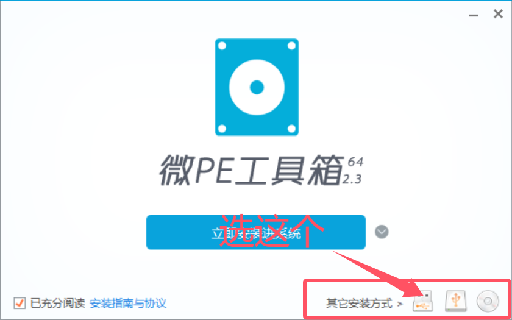
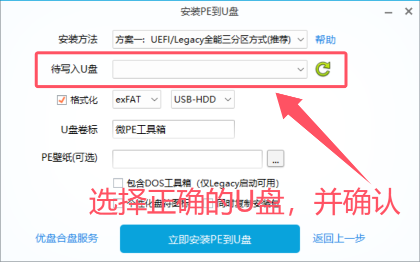
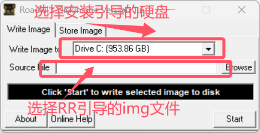

## 前言

通常黑群晖会选择U盘来作为引导盘，这样可以剩下一个硬盘位置。毕竟itx版型无论sata和pcie接口都是极其宝贵的，但是U盘总有缺陷（断头台、写入慢、容易坏）。所以也许有人会需要一个在硬盘中安装引导的方法。这篇内容比较水，主要也是留一个给幻梦自己看的笔记（部分PE系统过于精简，写入工具都很难选择使用）。

这篇文章只有写入引导的步骤，引导的配置工作请查看RR引导的官网或移步其他内容（b站直接搜“RR引导”，例如这个：BV1ESkpBiEH5）

## 选择硬盘

本来不想提这个的，但是想了想还是写了。

我们制作的这块引导盘，只有引导功能。不承担后续群晖系统的安装（群晖系统会被安装在你日后每一块使用的硬盘里，引导盘是不会被群晖系统使用到），所以推荐选一个小一点不容易坏的SSD硬盘，例如：傲腾M10（**傲腾硬盘存在兼容性问题**，先看自己的主板和CPU是否兼容，这里仅做介绍）。

## 安装WinPE

想要给一块硬盘写入镜像首先得有一个系统和软件。如果你有硬盘坞可以跳过这一步，直接插入你需要写入镜像的硬盘然后写入RR引导的镜像文件。如果没有先找一个U盘或者移动硬盘来制作PE

制作PE的第一步。**确定你的U盘或者别的什么介质里没有你要的东西了，或者已经做好备份**。看清楚加粗内容，请务必确认，数据无价。

我们可以选择的WinPE有很多，幻梦这边使用的是微PE，也就是Wepe。[https://www.wepe.com.cn/download.html](https://www.wepe.com.cn/download.html)

2.3与1.3版本幻梦的主机都可以运行，各位请按需选择。

下载完PE工具箱后，双击启动。

我们是在U盘制作WinPE，选择下面第一个U盘图案的图标。

选择你刚刚**已经备份好或确认无需保留数据**的U盘，点击立刻安装。

等待安装完成后进入下一步。

## 准备引导与写入工具

RR引导的发布地址：[https://github.com/RROrg/rr/releases](https://github.com/RROrg/rr/releases)

RR引导的官网：[https://rrorg.cn/categories/evaluation](https://rrorg.cn/categories/evaluation)

写入工具 Roadkil's Disk Image：[https://roadkil.net/program.php?ProgramID=12&Action=NewOSID&DownloadVersion=12&Installer=NO](https://roadkil.net/program.php?ProgramID=12&Action=NewOSID&DownloadVersion=12&Installer=NO)

重点就是这个写入工具。其他的像是rufus，幻梦基本都试过了。PE上不是启动不了就是读不到盘，就这个好用了。

下载好这些工具后，通通扔到刚刚制作好的PE U盘上，完成后安全弹出并拔出U盘。

## 写入引导

将拔出的U盘插到黑群晖主机上。设定好启动项，使开机U盘启动。

进入WinPE。我们直接打开Roadkil's Disk Image。

我们先选择正确的需要安装引导的硬盘位置，然后选择RR引导的img镜像文件（记得提前解压RR引导的压缩包，github发布页下载的一般是一个压缩包，img在压缩包里）

选择完成后点击“Start”

等待镜像写入完成后，关机拔出U盘，设置启动项为刚刚安装的引导盘。

进入RR引导。

## 结束

到这一步引导盘的制作已经完成了，详细的配置请查阅其他资料，幻梦这边就不做更多的教程了。
