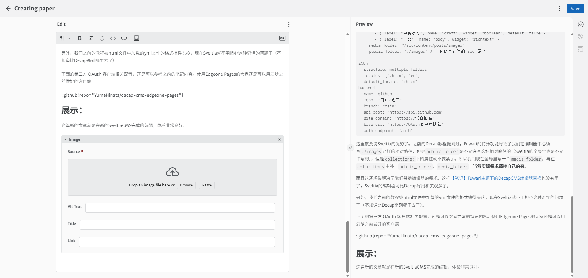
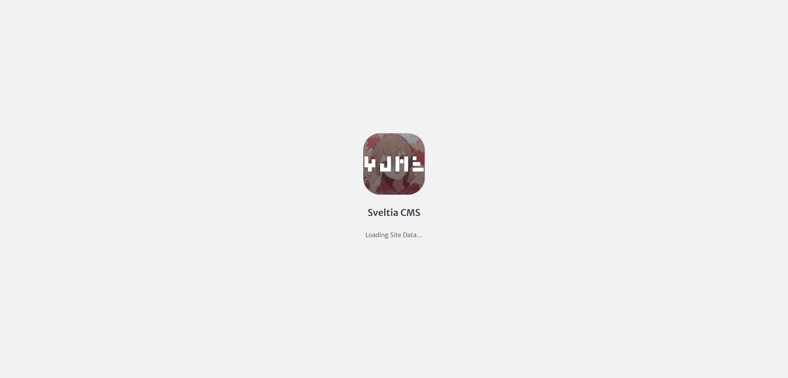
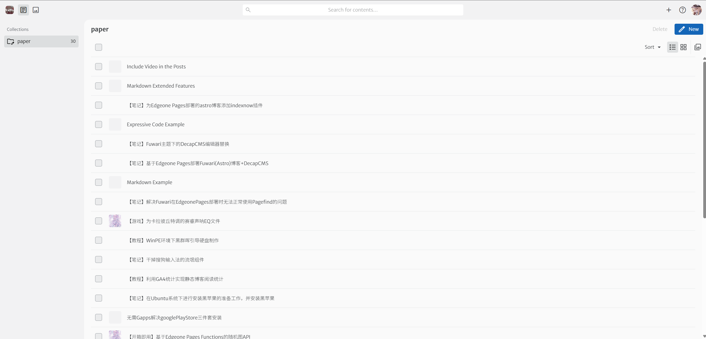
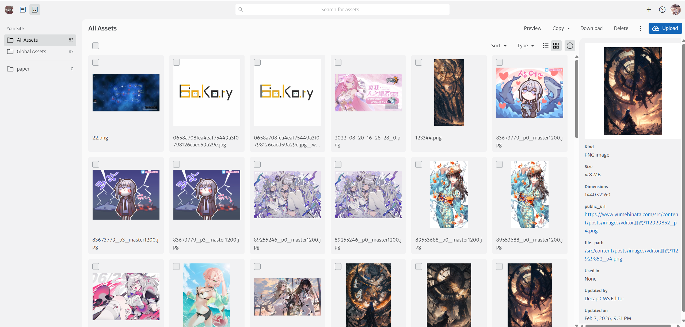
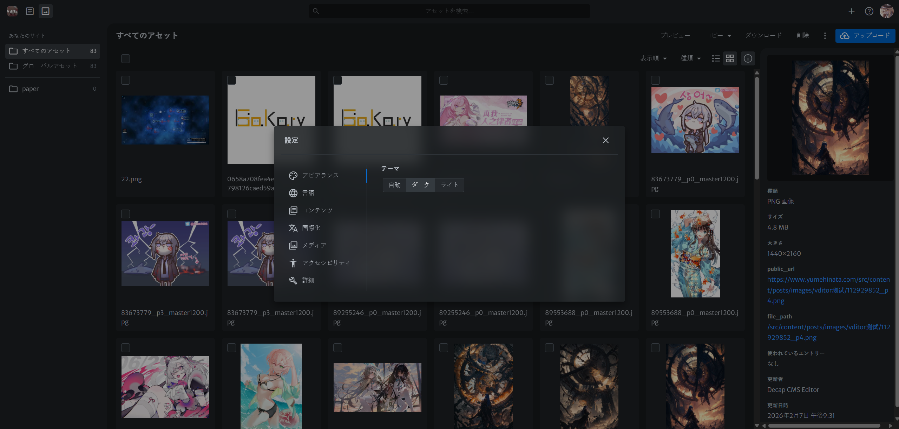

封面图：https://www.pixiv.net/artworks/113004958

## 前言：

如Sveltia CMS简介里说的一样，Decap CMS大抵已经死了。难看的UI、缺少的功能、奇怪的Bug、无用的文档、聊胜于无的更新，看起来没有必要再待在这条千疮百孔的船上了。

幸运的是Sveltia很好的兼容了Decap，所以几乎不需要修改之前的Decap配置内容，而且也不是非要用Sveltia的OAuth 客户端，这都大幅度降低了我们从Decap迁移的难度。

## 简单配置下文件

[【笔记】基于Edgeone Pages部署Fuwari(Astro)博客+DecapCMS](https://www.yumehinata.com/posts/%E5%9F%BA%E4%BA%8Eedgeone-pages%E9%83%A8%E7%BD%B2astro%E5%8D%9A%E5%AE%A2decapcms/#%E7%AC%AC%E4%BA%8C%E6%AD%A5%E9%83%A8%E7%BD%B2decapcms)前文我们准备了`src/pages/admin.html`这个Decap专用的admin页面，现在不需要了，就把它删掉。

我们重新在`/public/admin/`新建一个`index.html`

```html
<!DOCTYPE html>
<html>

<head>
    <meta charset="utf-8" />
    <meta name="robots" content="noindex" />
    <title>Sveltia CMS</title>
</head>

<body>
    <script src="https://fastly.jsdelivr.net/npm/@sveltia/cms/dist/sveltia-cms.js"></script>
</body>

</html>
```

Sveltia的config.yml配置文件如下

```yaml
logo_url: Sveltia的logo位置

media_folder: "/src/content/posts/images" # 文件将被存储在仓库中的位置

collections:
    - name: "terminal" # 用于路由，例如，/admin/collections/blog
    label: "paper" # 在 UI 中使用
    folder: "src/content/posts" # 存储文档的文件夹路径
    create: true # 允许用户在此集合中创建新文档
    fields: # 每个文档的字段，通常在 front matter 中
            - { label: "标题", name: "title", widget: "string" }
            - { label: "发布日期", name: "published", widget: "datetime", type: "date" }
            - { label: "描述", name: "description", widget: "text", required: false }
            - { label: "封面图片", name: "image", widget: "image", default: "https://rdimg.yumehinata.com/random-wallpaper"}
            - { label: "标签", name: "tags", widget: "list", required: false }
            - { label: "分类", name: "category", widget: "string", required: false }
            - { label: "草稿状态", name: "draft", widget: "boolean", default: false }
            - { label: "正文", name: "body", widget: "richtext" }
    media_folder: "/src/content/posts/images/{{slug}}"
    public_folder: "./images/{{slug}}" # 上传媒体文件的 src 属性

i18n:
  structure: multiple_folders
  locales: ["zh-cn", "en"]
  default_locale: "zh-cn"
backend:
  name: github
  repo: "用户/仓库"
  branch: "main"
  api_root: "https://api.github.com"
  site_domain: "https://博客域名"
  base_url: "https://OAuth客户端域名"
  auth_endpoint: "auth"
```

这里就要说Sveltia的优势了。之前的Decap教程提到过，Fuwari的特殊功能导致了我们在编辑器中必须写`./images`这样的相对路径，但是`public_folder`是不允许写这种相对路径的（Sveltia的全局里也是不允许写的），但是`collections:`下的属性就不要紧了。所以我们现在全局里写一个`media_folder`，再在`collections`中补上`public_folder`、`media_folder`。**当然实际需求请按自己的来**。

而且这还顺带解决了我们替换编辑器的需求，这样[【笔记】Fuwari主题下的DecapCMS编辑器替换](https://www.yumehinata.com/posts/%E7%AC%94%E8%AE%B0fuwari%E4%B8%BB%E9%A2%98%E4%B8%8B%E7%9A%84decapcms%E7%BC%96%E8%BE%91%E5%99%A8%E6%9B%BF%E6%8D%A2/)也没有用了，Sveltia的编辑器可比Decap好用和美观多了。

另外，我们之前的教程被html文件中加载的yml文件的格式搞得头疼，现在Sveltia就不用担心这种奇怪的问题了（不知道比Decap高到哪里去了）。

下面的第三方 OAuth 客户端相关配置，还是可以参考之前的笔记内容。使用Edgeone Pages的大家还是可以用幻梦之前做好的客户端

::github{repo="YumeHinata/dacap-cms-edgeone-pages"}

## 展示：

这篇新的文章就是在新的SveltiaCMS完成的编辑，体验非常良好。












比Decap美观太多了
