封面图：https://www.pixiv.net/artworks/145105485

## 前言：

Umami无疑是最适合个人静态博客的自建统计系统了，但是你需要一个服务器来部署Umami。那么有没有一个不需要自己准备服务器就能使用的统计工具呢？有的，Google Analytics正是我们需要的。不过GA4的缺点就是**可能会被用户过滤**，**统计结果不够及时**，以及**谷歌服务本身在当前环境下的不稳定性**。幸好幻梦是不在意这些问题的，如果要选择这个方案最好也衡量一下自己是否也不在意。

## 第一步：使用Analytics统计

<https://marketingplatform.google.com/about/analytics/?hl=zh-CN>

在首页开始，注册一个Analytics账号。

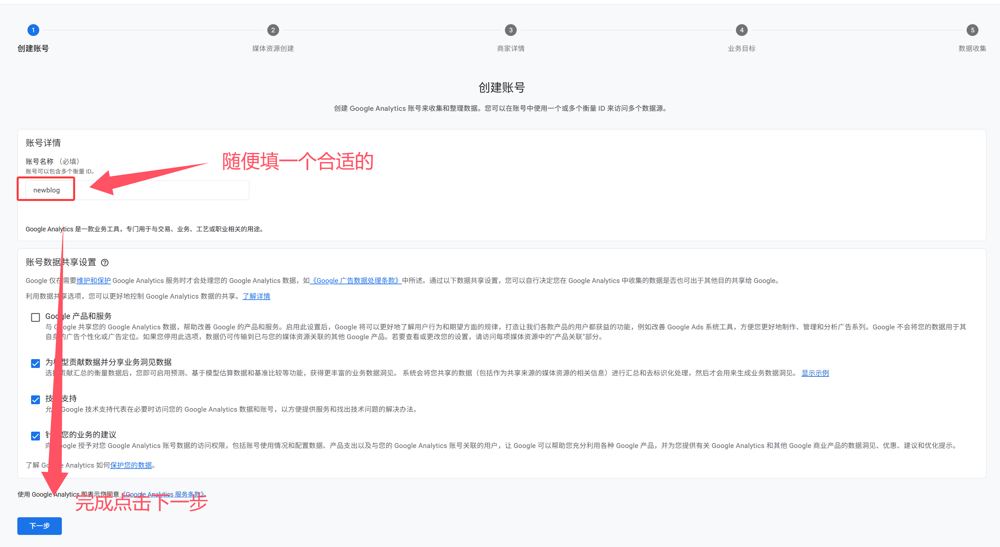

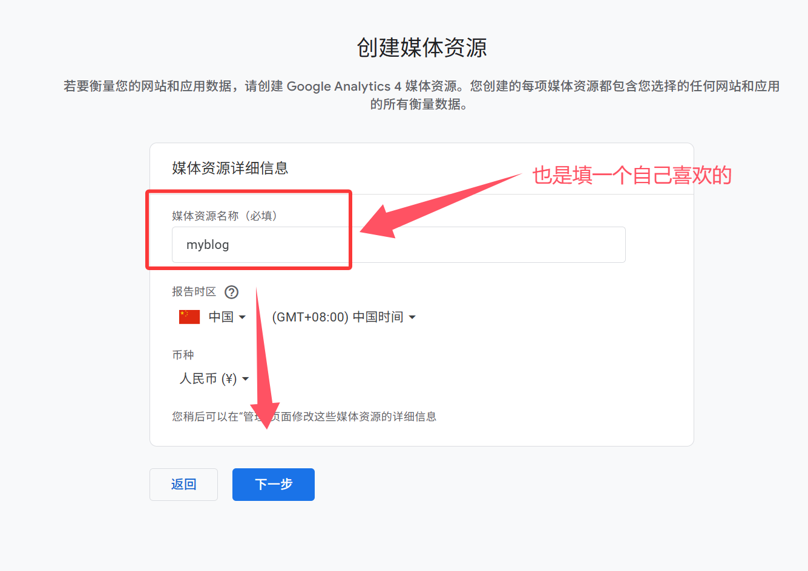

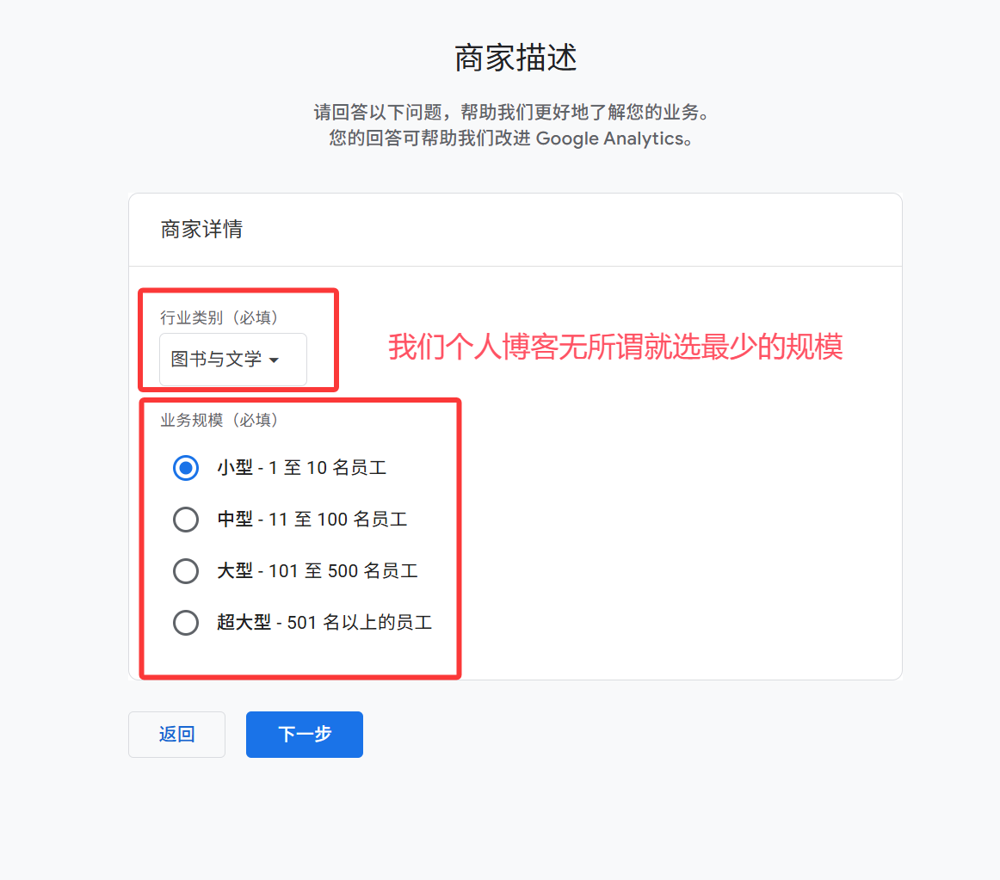

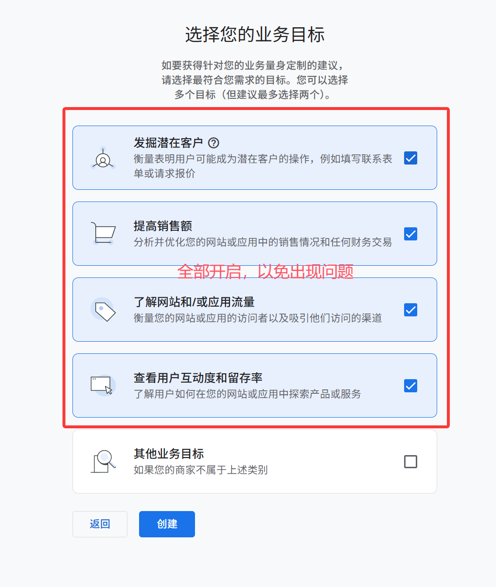

点击创建，进入下一个环节，选择网站。

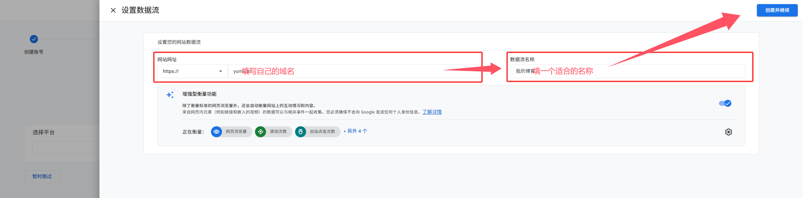

google会给你一串代码，我们放到需要统计的网页中

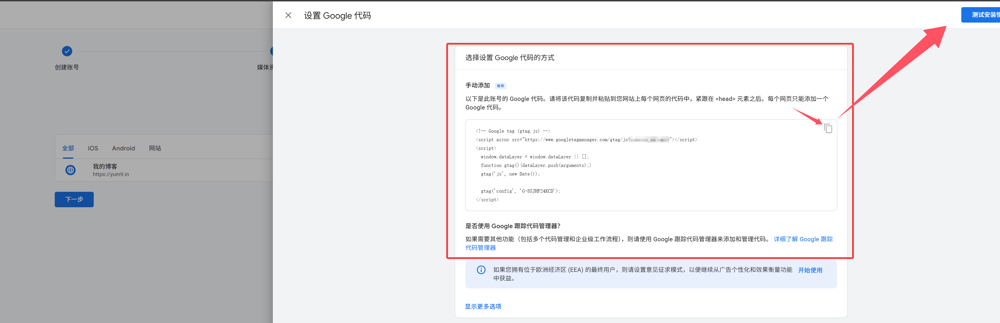

完成后点击测试，当有数据时会是以下的显示

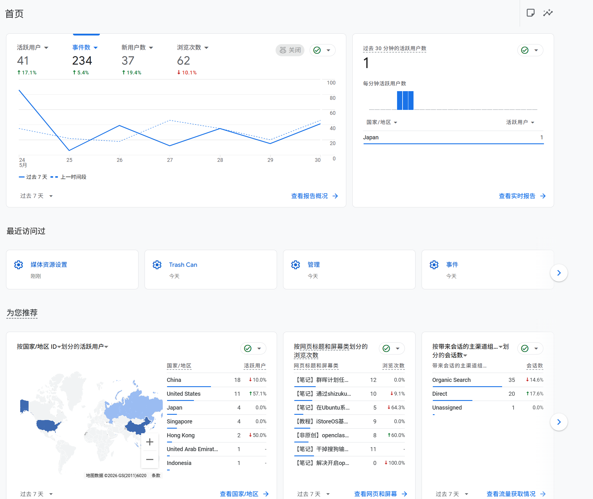

在设置中可以看到**媒体资源ID**，记录下来

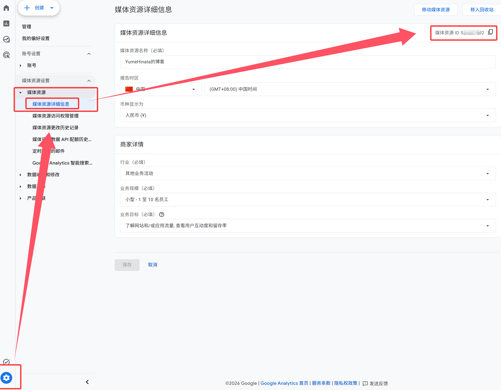

## 第二步：调用Google Analytics Data API

### 进入Google cloud console

<https://console.cloud.google.com/>

搜索`Google Analytics Data API`点击进入

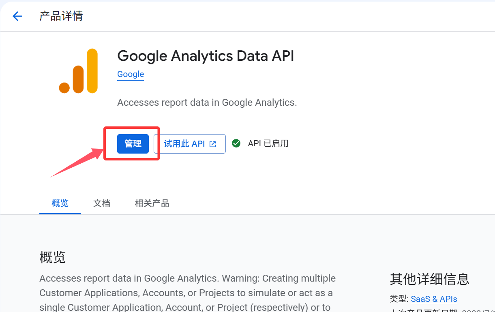

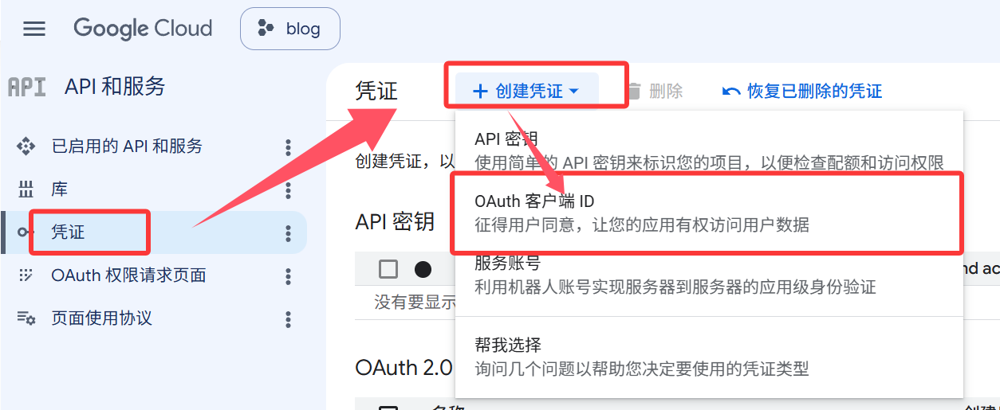

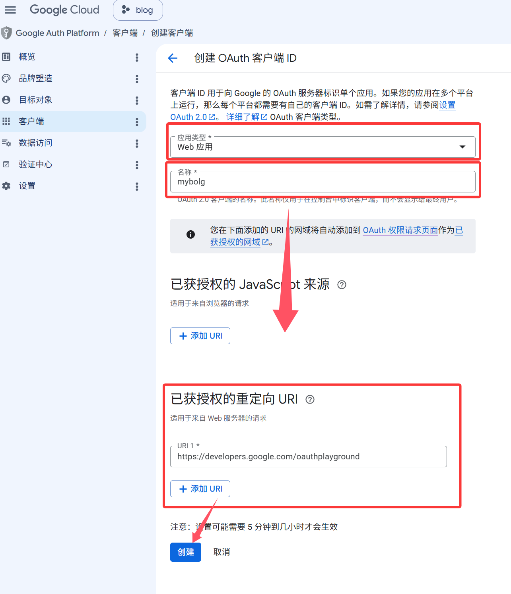

这边的URI是`https://developers.google.com/oauthplayground`**一定要添加并填写这个**

点击创建得到ID与密钥，**做好保存**等会要用。

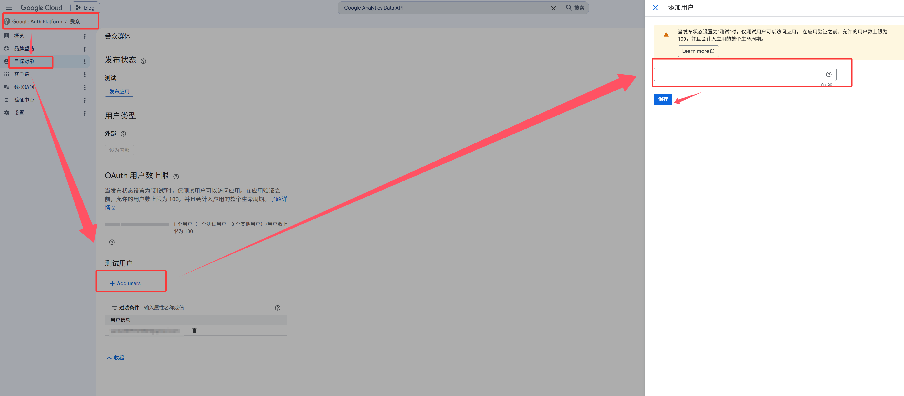

还是这个页面下，目标对象中创建一个测试用户，不然下面这一步验证不了

### 进入Google OAuth 2.0 Playground

<https://developers.google.com/oauthplayground/>

在设置中勾选复选框，填入你的id与密钥

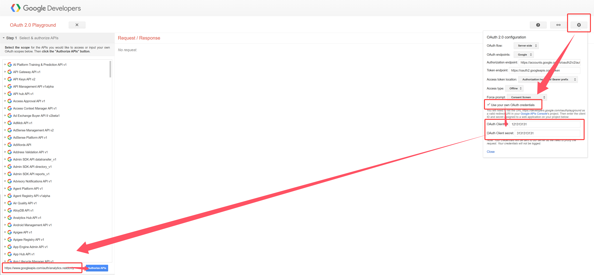

在右侧的输入框里填入`https://www.googleapis.com/auth/analytics.readonly`点击 Authorize APIs，完成登录验证，将会跳转进入Step 2: Exchange authorization code for tokens

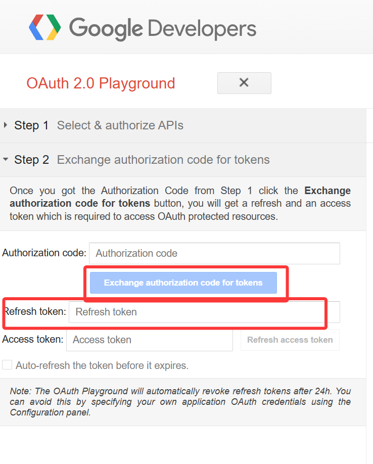

这里点击进行兑换，我们把得到的**Refresh token保留下来**

## 第三步：使用github同步数据

::github{repo="YumeHinata/GA4-Click-Statistics"}

可以fork幻梦创建的这个仓库来完成获取GA4的数据并保存到仓库的`data/views.json`中

使用前需要在刚刚fork的仓库中设置一些内容

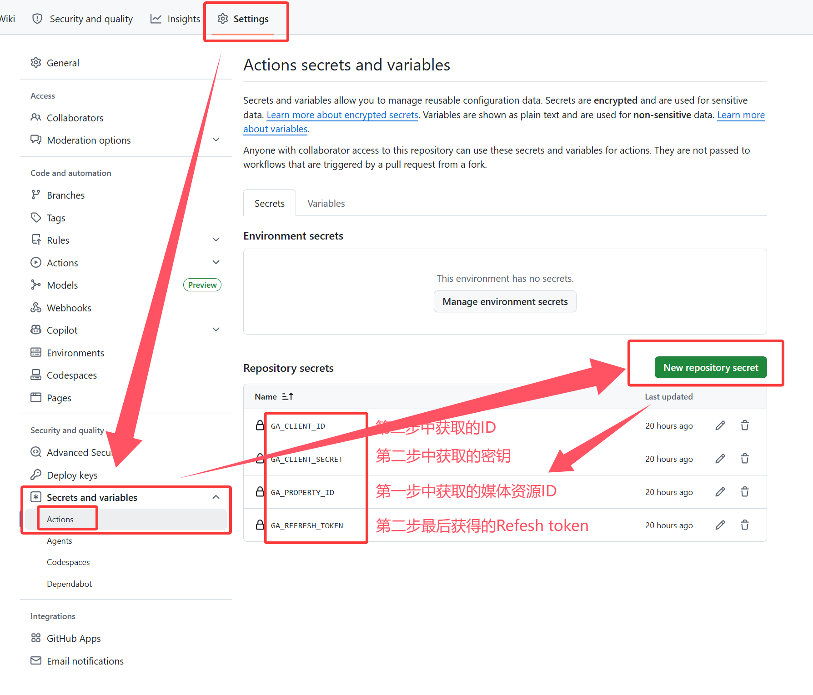

我们需要新建变量`GA_CLIENT_ID`、`GA_CLIENT_SECRET`、`GA_PROPERTY_ID`、`GA_REFRESH_TOKEN`

填写完毕后进入action运行一次

运行成功后就可以去前端调用了

## 杂项：Fuwari的适配

Fuwari首先就是文章卡片中需要显示阅读量

在`src-components-PostCard.astro`中

```
const hasCover = image !== undefined && image !== null && image !== "";

const coverWidth = "28%";

const { remarkPluginFrontmatter } = await entry.render();
//找到以上内容，加入下面这条
const cleanUrl = url.endsWith("/") && url !== "/" ? url.slice(0, -1) : url; // 用于匹配 views.json 中的路径，确保末尾没有斜杠（除非是根路径）
```

```
<div
  class="text-sm text-black/30 dark:text-white/30 flex gap-4 transition"
>
    <div>
      {remarkPluginFrontmatter.words}
      {
        " " +
          i18n(
            remarkPluginFrontmatter.words === 1
              ? I18nKey.wordCount
              : I18nKey.wordsCount,
          )
      }
      </div>
      <div>|</div>
      <div>
      {remarkPluginFrontmatter.minutes}
      {
        " " +
          i18n(
            remarkPluginFrontmatter.minutes === 1
              ? I18nKey.minuteCount
              : I18nKey.minutesCount,
            )
      }
      </div>
//找到以上内容加入以下的代码
      <div>|</div>
      <div
        class="data-astro-cid-iyiqi2so postcard-view-count"
        data-path={cleanUrl}
        style="--coverWidth: 28%;"
      >
      </div>
</div>
```

```
<script>
    async function initCardViews() {
        const targets = document.querySelectorAll(".postcard-view-count");
        if (targets.length === 0) return;

        try {
            // 只请求 1 次原始简洁的 json 字典
            const res = await fetch(
                "https://fastly.jsdelivr.net/gh/YumeHinata/GA4-Click-Statistics@main/data/views.json",
            );
            if (!res.ok) return;
            const viewsMap = await res.json();

            // 批量匹配并填入对应卡片的阅读量
            targets.forEach((el) => {
                const path = el.getAttribute("data-path");
                if (path && viewsMap[path] !== undefined) {
                    el.textContent = viewsMap[path] + " 次阅读";
                } else {
                    el.textContent = "0 次阅读";
                }
            });
        } catch (e) {
            console.error("Failed to fetch GA4 views:", e);
        }
    }

    // 页面首次加载时运行
    initCardViews();
    // 适配 Fuwari 主题的视图切换动画 (View Transitions)
    document.addEventListener("astro:after-swap", initCardViews);
</script>
//在末尾的style标签以上添加以上代码
```

以上就基本完成了所有工作
