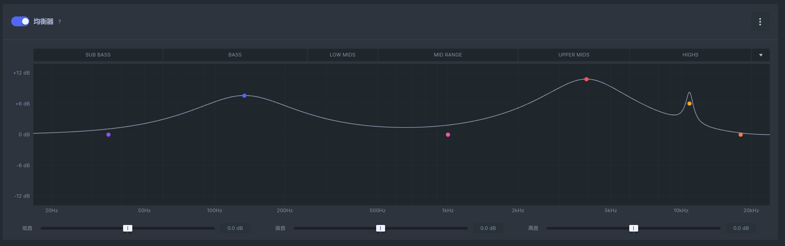
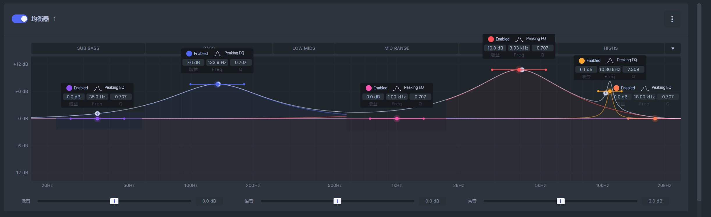
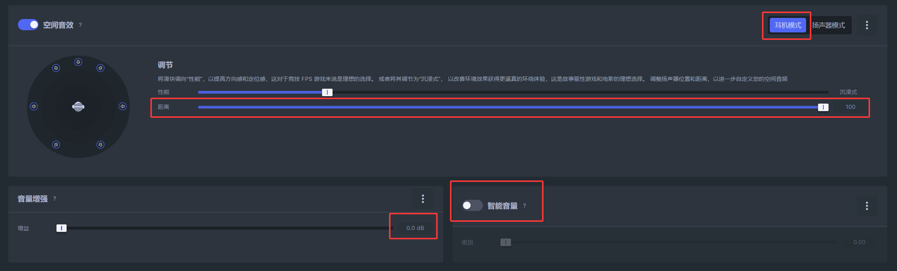

## 分享链接：

需要注意的是幻梦使用的耳机是赛睿Nova7p，不同品牌型号耳机可能存在默认eq不同的问题，所以这个配置不一定是最适合你的，只是提供一种可以有效放大弦化下飘飞、贴墙、走路，与正常走路脚步声的参考。

<https://www.steelseries.com/deeplink/gg/sonar/config/v1/import?url=aHR0cHM6Ly9jb21tdW5pdHktY29uZmlncy5zdGVlbHNlcmllc2Nkbi5jb20vdjEvZDg4NzVjNGEtZDE2ZC00NDA3LWI2N2QtMjZhOGQ0Yjg4MWZk>

这个链接应该可以直接获取到配置，不过为了防止分享失效下面会给出详细的设置内容。

## 详细设置：

以上就是均衡器的详细参数。

开启空间音效-耳机模式，关闭音量增强与智能音量，距离拉满
