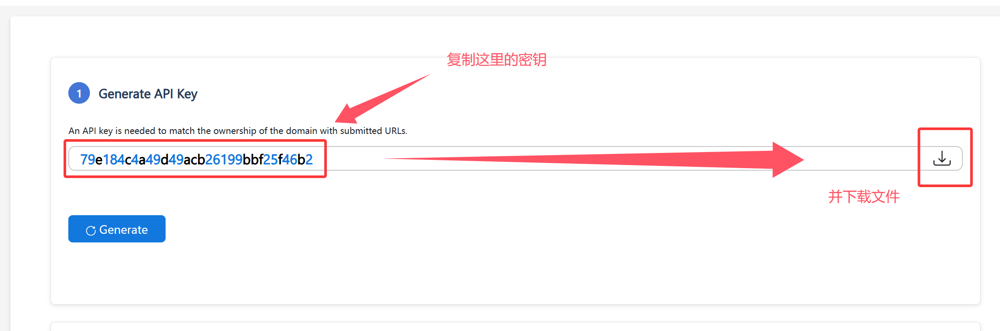
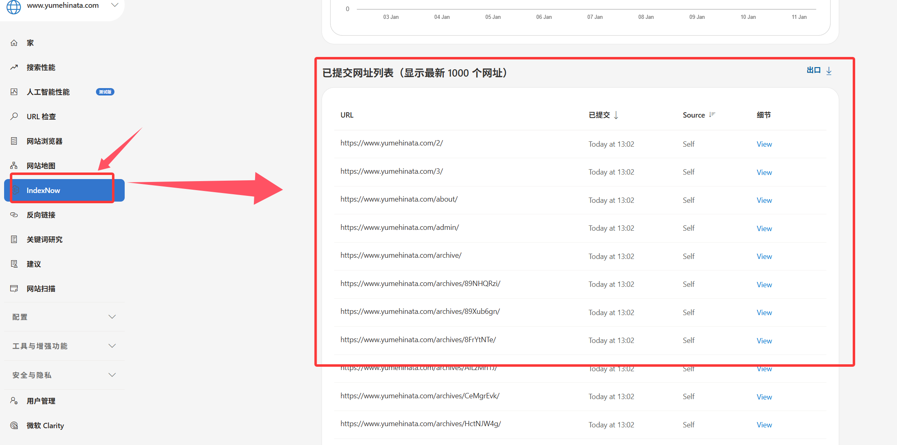

封面图：https://www.pixiv.net/artworks/145910364

## 前言：

indexnow每次最多提交10000个url，提交indexnow后的爬取也会消耗额度。因此astro-indexnow插件为我们提供了.astro-indexnow-cache.json缓存，避免重复提交indexnow。但是这个缓存文件在Tencent Edgeone pages上有点水土不服，幻梦的这篇笔记主要就解决了这个问题。

## 第一步：安装IndexNow

::github{repo="velohost/astro-indexnow"}

首先在astro博客本地的文件夹中安装astro-indexnow

`npm install astro-indexnow`

astro-indexnow相关配置会自动的写入package.json、package-lock.json中。

插件安装后需要在`astro.config.mjs`中进行配置，在配置前我们先前往<https://www.bing.com/indexnow/getstarted> 获取API密钥和文件。



把密钥的文件放到静态博客的`/public`目录下，并打开`astro.config.mjs`在合适位置添加以下内容

```
import { defineConfig } from "astro/config"; //这个不用加，在这附近加入下面这一行
import indexnow from "astro-indexnow";

export default defineConfig({  //这个和下面这个都不用添加，找到这个代码块
  site: "https://example.com",  //这个不用额外加，一般不会存在没有配置站点域名的情况
  integrations: [  //还是不用加这个，找到integrations这个数组，添加下面indexnow这个函数
    indexnow({
      key: process.env.INDEXNOW_KEY,  //这里可以用环境变量，但是反正都要在public里放一个txt文件的，直接写明文也不要紧
      cacheDir: "./public/",  //这里是.astro-indexnow-cache.json的目录，笔记默认按照这个位置不建议盲目修改。
      enabled: false, //indexnow插件可以通过这个参数开启，但是我们先不启用插件
    }),
  ],
});
```

## 第二步：为Edgeone Pages解决.astro-indexnow-cache.json持久化

indexnow提供的`.astro-indexnow-cache.json`只有在Git(CI/CD)进行部署或者在本地进行部署时才能有效果（edgeone可没法持久保留这个文件，也没办法操作github仓库）。但是如果我们将`.astro-indexnow-cache.json`文件放到public中，那么我们就能够通过url直接访问到`.astro-indexnow-cache.json`，在推送发生后`astro build`前我们可以再通过命令把`.astro-indexnow-cache.json`下载到一个文件夹里，提供indexnow插件调用不就能够变相的完成持久化了吗（这里为了方便就直接下载到public目录下，因此前文的配置也是指向了public目录）。

到这里看似解决了所有问题，但是还有点瑕疵。edgeone在实际编译页面时indexnow插件运行后的新`.astro-indexnow-cache.json`不会被生成到`public`目录里，通过一些方法最后幻梦知道是生成在了`.edgeone/assets/`目录下，我们只需要再通过`cp ./public/.astro-indexnow-cache.json .edgeone/assets/`把缓存文件替换即可完成闭环。

因此我们的`package.json`需要进一步修改。

```
  "scripts": {  //找到这个scripts，下面有一个build（这个不用新增）

    "build": "astro build && pagefind --site dist",  //一般长这个模样，我们稍作修改。如下：(这一行的build记得删掉，只留下修改完成的)
    "build": "(curl -fs https://example.com/.astro-indexnow-cache.json -o ./public/.astro-indexnow-cache.json || echo '{}' > ./public/.astro-indexnow-cache.json) && astro build && cp ./public/.astro-indexnow-cache.json .edgeone/assets/ && pagefind --site dist",
  },

```

**上方的域名改为你博客的域名**即可。

完成这些后，我们先进行一次提交（需要注意的是，此时我们**没有启用**indexnow插件，因为我们需要把密钥的txt文件先上传上去，保证能够正常访问到这个txt文件后再启用插件）

当编译完成后，我们尝试访问`https://example.com/<YOUR_KEY>.txt`检查是否能够正常打开。若能正常打开我们可以尝试运行以下命令测试自己的你的api能否正常使用。（以下命令在Windows powershell运行测试）

```
[Net.ServicePointManager]::SecurityProtocol = [Net.SecurityProtocolType]::Tls12

$body = @{
    host        = "你的博客域名，不要带https://这些"
    key         = "你获取到的密钥，确保和刚刚上传的文件一致"
    keyLocation = "https://example.com/你的密钥.txt ，你刚刚访问成功的密钥文本url"
    urlList     = @("https://www.example.com/，提交验证的url，最好就是你的博客站主页url")
} | ConvertTo-Json -Compress

Invoke-RestMethod -Uri "https://www.bing.com/indexnow" -Method Post -ContentType "application/json; charset=utf-8" -Body $body
```

如果没有任何报错，就是一切正常，可以进入下一步，如果报错403，那就要重新生成一个密钥和密钥文件了（也有可能是爬虫被拦截了，但是这个概率很小），如果报错422那就是超量使用了，一样换一个密钥和文件。

一切测试正常了，我们回到`astro.config.mjs`，把刚刚的`enabled: false,`改为`enabled: true,`启用astro-indexnow。

## 检查indexnow的提交：

当提交成功后我们可以到<https://www.bing.com/webmasters> 登录绑定自己的网站，查看indexnow的提交记录。


