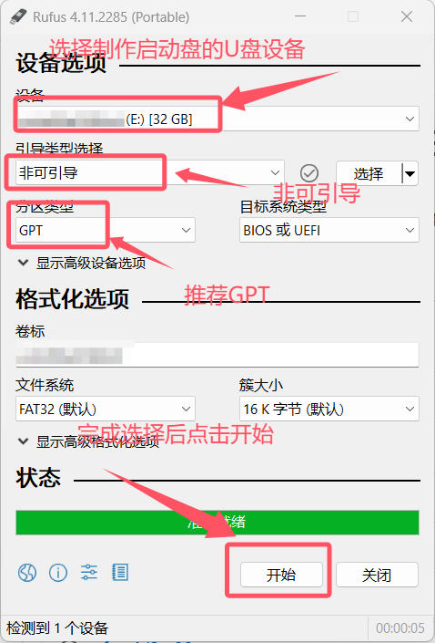
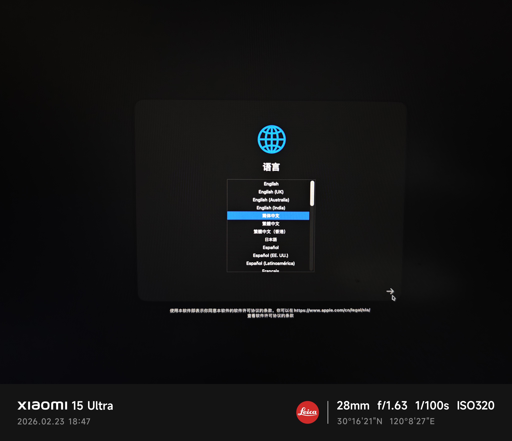
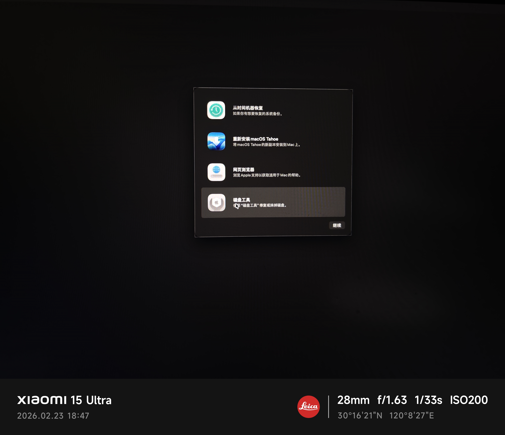
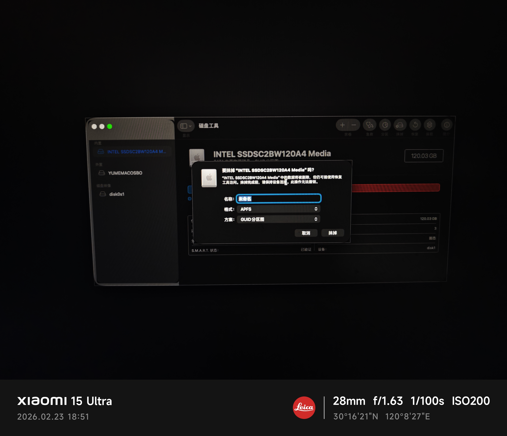
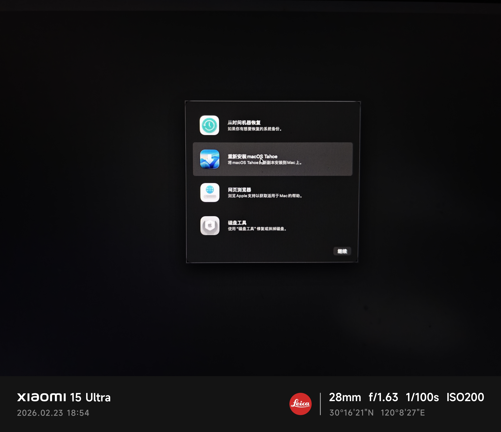

## 题记：

这大概是一种极其小众的需求吧，结果被幻梦遇上了。之前应该有提到过，幻梦的动态博客halo部署在一台nuc小主机上，总受周知nuc在这个时代成为软路由圣体之前其实是安装黑苹果的首选项，尤其是nuc5中的NUC5i5RYK。因为这台机器搭载了一个可能是除了苹果以外只有intel在自家主机上有使用过的5代i5处理器，5250u。现在动态博客不用了，小主机也就闲置下来了，于是在黑苹果生命的末期来体验一下，圆上幻梦一个折腾黑苹果的梦。

## 警告：

只是部分一定要在被安装的主机上进行的工作会在ubuntu上完成，剩下非必要环节放在Windows上完成（例如：烧录到U盘）与MacOS完成（例如：usb映射），另外这篇笔记里还存在一些未解决的问题，仅供参考。如果你在安装环节遇到一些问题，且项目的issues里没有提供解决方案的话，请善用Ai工具来完成检索和解答。此外目前由于5250u的核显为hd6000，因此Mac OS15应该是5250u最后支持的一个版本，但是我们不选15而是选择12作为体验。

## 安装Hardware-Sniffer

通常Hardware-Sniffer是OpCore-Simplify自带的一个模块，但是由于我们是linux环境所以得特意安装一个linux支持的。

```
# 新建一个目录然后克隆项目
git clone https://github.com/lzhoang2801/Hardware-Sniffer.git

# 进入目录运行HardwareSniffer.py
python3 HardwareSniffer.py
```

进入后，选H输出Report.json

回车返回，选A输出ACPI

现在`Hardware-Sniffer`文件夹下会有一个`SysReport`，`SysReport`下有一个`Report.json`和`ACPI`文件夹，把这两个复制到一回会克隆好的OpCore-Simplify文件夹里。

## 安装OpCore-Simplify

```
# 新建一个目录然后克隆
git clone https://github.com/lzhoang2801/OpCore-Simplify.git

# 把刚刚复制的json和文件夹丢到项目里
# 运行OpCore-Simplify.py
python3 OpCore-Simplify.py
```

选择1，输入`Report.json`的路径。nuc5可能会出现以下报错

### nuc5提取时遇到的问题及解决方法

```
Validation report for: /home/yume/opcore/OpCore-Simplify/Report.json

Hardware report is not valid! Please check the errors and warnings below.

Errors (7):
    1. Root.Monitor.ICD2400.Connector Type: Value 'HDMI-A' does not match pattern '^(VGA|DVI|HDMI|LVDS|DP|eDP|Internal|Uninitialized)$'
    2. Root.Monitor.ICD2400: Missing required key 'Connector Type'
    3. Root.System Devices.PNP0C0B.ACPI Path: Value '\_TZ_.FAN3' does not match pattern '^[\\]?_SB(\.[A-Z0-9_]+)+$'
    4. Root.System Devices.PNP0C0B_#1.ACPI Path: Value '\_TZ_.FAN1' does not match pattern '^[\\]?_SB(\.[A-Z0-9_]+)+$'
    5. Root.System Devices.PNP0C0B_#2.ACPI Path: Value '\_TZ_.FAN4' does not match pattern '^[\\]?_SB(\.[A-Z0-9_]+)+$'
    6. Root.System Devices.PNP0C0B_#3.ACPI Path: Value '\_TZ_.FAN2' does not match pattern '^[\\]?_SB(\.[A-Z0-9_]+)+$'
    7. Root.System Devices.PNP0C0B_#4.ACPI Path: Value '\_TZ_.FAN0' does not match pattern '^[\\]?_SB(\.[A-Z0-9_]+)+$'

Warnings (4):
    1. Root.BIOS: Unknown key 'Above 4G Decoding'
    2. Root.GPU.Intel Corporation HD Graphics 6000: Unknown key 'Bus Type'
    3. Root.Sound.Realtek ALC283: Unknown key 'PCI Path'
    4. Root.Sound.Realtek ALC283: Unknown key 'ACPI Path'
```

我们根据提示进行修改即可，唯一需要关注的点是风扇的ACPI 路径。

```
# 安装acpica-tool
sudo apt install acpica-tools -y

# 导出ACPI log
sudo acpidump > acpi.log

#提取dat
acpixtract -a acpi.log

# 反编译dsdt
iasl -d dsdt.dat
```

我们打开`dsdt.dsl`文件，检索关键词`fan`。会发现以下内容

```
If ((Arg0 == 0x03))
        {
            If ((Zero == ACTT))
            {
                If ((ECON == One))
                {
                    \_SB.PCI0.LPCB.H_EC.ECWT (Zero, RefOf (\_SB.PCI0.LPCB.H_EC.CFAN))
                }
            }
        }
```

`\\_SB.PCI0.LPCB.H_EC` 替换掉所有`\_TZ_.FAN`相关内容，保存。

### 导入Report.json后

接着根据提示我们导入ACPI文件，之前我们已经把ACPI文件夹复制到了OpCore-Simplify里，可以直接输入`ACPI`回车，下一步，如果没有导入的输入`ACPI`文件夹的绝对路径。

### 导出EFI文件

前面根据自己需求选完选项后，会回到脚本主页（不清楚的选项就默认，MacOS的版本能最新就最新）。选择6导出EFI。

EFI会被导出到`/tmp/`路径下，这个时候我们不要点任何按钮进行下一步，立刻通过其他工具将EFI复制到其他稳定的路径里。如果不小心点击了下一步，恭喜你重新导入Report.json把选项重新选一遍把，临时文件夹关闭后即刻删除。

## 下载MacOS12镜像

先安装`acidanthera/OpenCorePkg`工具

还是在一个合适的位置克隆项目

```
# 克隆项目
git clone https://github.com/acidanthera/OpenCorePkg.git

# 进入工具目录
cd ./OpenCorePkg/Utilities/macrecovery

# 拉取15版本镜像
python3 macrecovery.py -b Mac-E43C1C25D4880AD6 -m 00000000000000000 download
```

把包含镜像的文件夹`com.apple.recovery.boot`、此前的EFI文件夹还有`usb_blueprint.json`保存到一台可以制作启动u盘的系统上，幻梦这边还是使用了Windows来完成这个工作。

## 制作启动U盘

下载一个Rufus来制作启动盘

[https://github.com/pbatard/rufus/releases](https://github.com/pbatard/rufus/releases)



**千万要注意**，此操作需要**格式化u盘**，请确保u盘里已经**做好备份**或内部无再需要的文件。

初始化u盘后将`EFI`、`com.apple.recovery.boot`文件夹、`usb_blueprint.json`拖入盘内。

启动U盘制作完成，安全弹出后插在准备安装U盘的主机上，进入bios选择u盘启动。

## 进入启动盘

进入引导后选择第一个选项运行。此时会出现黑屏，这是正常情况，等一段时间会出现跑码，此时说明成功进入安装环节。



选择对应的语言


选择磁盘工具对硬盘进行操作


点进去先别急着操作，想清楚**自己有几块硬盘**；**需要在哪一块硬盘上安装系统**；**需要抹除的硬盘是否还有重要资料未保存**；**是否真的需要抹除硬盘**。

想清楚上面的内容再进行后面的操作

幻梦这边是单硬盘，空间也不够只能选择抹除掉原来的ubuntu来安装MacOS


抹除硬盘后选择正确的硬盘进行安装（Mac OS 12名称应该为Monterey，幻梦第一次就安装错了，这是最后检查的机会，不然一会只能重装了）

后面就等待进度条完成，过程中可能会反复重启几次。

最后进入设置界面完成设置。

## 生成UTBMap.kext文件

现在我们应该顺利进入到MacOS系统了，可能还存在一些小问题或者卡顿的大问题，如果出现卡顿问题先跳转到下面疑难杂症里面尝试解决，为了保证阅读到流畅性还是先写如何导入。

这一步再掏出一个u盘，随便挑一个windowsPE装好。同时带EFI文件的那个u盘也别把，把新的windowsPE盘插上，进winPE。

（这步主要是力求完美的操作，之前自动化生产的EFI通常已经能驱动usb设备了，真不想做可以不做这一步）

```
# 进入pe后前往release页
https://github.com/USBToolBox/tool/releases

# 下载最新的release文件，并解压
# 文件夹内 shift+鼠标右键，打开cmd或powershell

```
