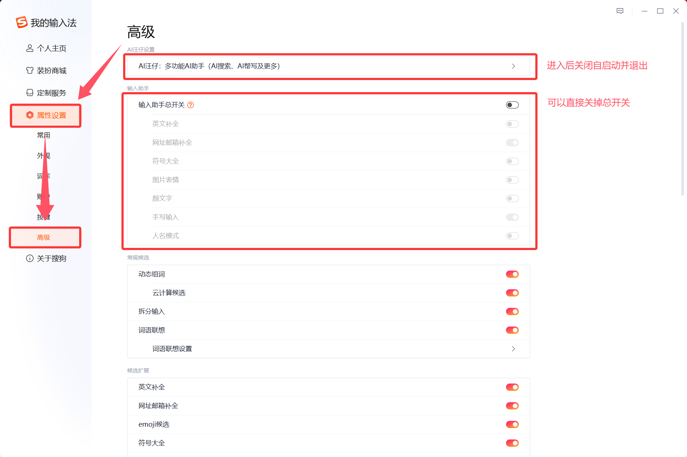
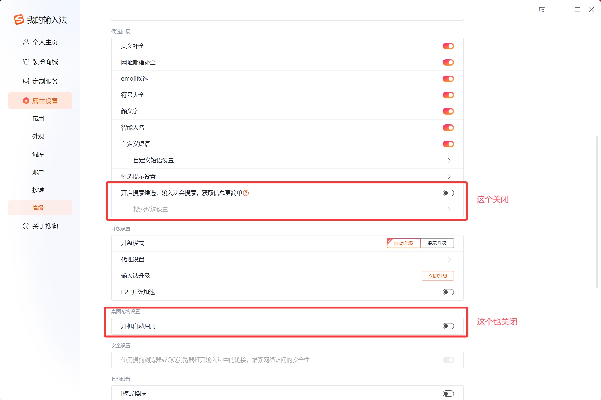
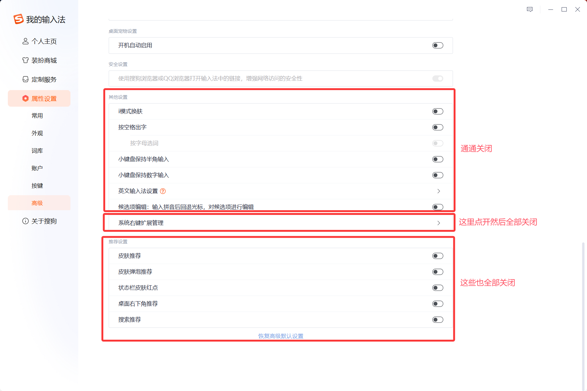
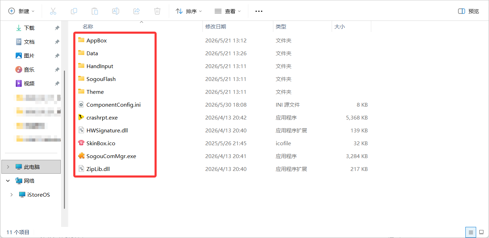

## 前言：

幻梦基本上是对搜狗输入法忍无可忍了，之前直接把搜狗整个卸掉换了微软输入法和小狼毫。后两者确实很干净、轻量，可是微软输入法的词库问题，小狼毫的美化问题（对于正常使用几乎无感）确实又影响日常的体验。还是得把搜狗输入法从垃圾桶里捞出来，不过得想办法清洗干净。

## 第一步：阻止搜狗输入法使用网络

安装完搜狗输入法，我们先安装一些需要联网的内容，例如：皮肤。然后让我们看看这个github项目

::github{repo="yongxin-ms/DisableSogouNetwork"}

<https://github.com/yongxin-ms/DisableSogouNetwork/archive/refs/heads/master.zip>

这个项目是通过Windows自带的防火墙规则阻止搜狗输入法的入站与出站，下载这个压缩包后可根据readme的说明使用。

## 第二步：调整输入法设置

以下这些都是广告开关，通通点击关闭。







## 第三步：删掉垃圾

搜狗输入法的安装路径`SogouInput\Components`里面都是一些额外的组件，**但是并不是每一个都需要删掉**。



我们只需要**保留以上的组件**即可，其他文件夹全部删除。遇到删除不掉的，进入Windows的安全启动尝试删除，如果还是删不掉可以尝试关闭进程后重命名，重启后再删除。

## 第四步：该死的壁纸功能

搜狗输入法的更换壁纸与电脑主题是通过appx注册的，所以通常手段删不掉。

```
Get-AppxPackage | Where-Object {$_.Name -like "*wallpaper*"} | Select Name, PackageFullName
```

运行以上命令查看wallpaper扩展是否存在，如果存在运行以下命令。

```
Get-AppxPackage -AllUsers *WallpaperChangeMenu* | Remove-AppxPackage -AllUsers
```

## 扩展阅读：

<https://zhuanlan.zhihu.com/p/5569093059>

<http://opinion.people.com.cn/n1/2021/0616/c431649-32132196.html>

<https://www.landian.news/archives/99829.html>
