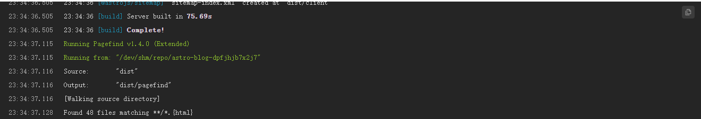

封面图：https://www.pixiv.net/artworks/146641763

## 序：

这次就不说前言了，因为根本没什么好注意的。其实fuwari博客的搜索功能从部署完一开始就是坏的，之前幻梦一直不高兴修（本来以为是作者没有把功能实现，想试试有没有更好的搜索方案的，结果发现是原来自带的功能坏了），查了下issues发现可能是pagefind的问题<https://github.com/saicaca/fuwari/issues/529>。再F12看一下，果然pagefind.js加载是报错的。这个时候就发现<https://github.com/saicaca/fuwari/pull/706> 提过修复的办法。试下来发现不对啊，怎么还是没有生成，赶紧看log……这log里不是有pagefind的输出吗？

什么时候有的呢，查了下记录原来幻梦的命令根本就没错，其实从部署那天开始pagefind就是好的。那文件去哪了？之前的**[【教程】利用GA4统计实现静态博客阅读统计](https://www.yumehinata.com/posts/%E6%95%99%E7%A8%8B%E5%88%A9%E7%94%A8ga4%E7%BB%9F%E8%AE%A1%E5%AE%9E%E7%8E%B0%E9%9D%99%E6%80%81%E5%8D%9A%E5%AE%A2%E9%98%85%E8%AF%BB%E7%BB%9F%E8%AE%A1/)** 遇到过输出结果与可见文件不相符的问题，这次可能又是Edgeone的锅，于是就有了下面的这个修改。

## 订正：

`astro build  && pagefind --site dist`改为`astro build  && pagefind --site .edgeone/assets`即可。

## 碎碎念：

修改方法极其简单，但是先确定你的pagefind是否正常的运行了，如果没有运行先看看上面**序**里提到的两个issues，先让pagefind运行起来，后面再用这个针对EdgeonePages的解决方案（EdgeonePages截止发稿时，这个问题百分百能复现，任何插件只要是输出到`dist`，又没有被Edgeone识别移动到`.edgeone/assets/`那就一定会出问题）。

~~pagefind除了`--site dist`这个参数外，还有`--output-path`参数，能指定输出到对应目录。那么Edgeone能够正常被访问的目录不是`dist`而是`.edgeone/assets/`。所以我们只需要把原本的`pagefind --site dist`修改为`pagefind --site dist --output-path .edgeone/assets/pagefind`一切问题就都解决了。~~

其实还没解决，这样改的跳转url会多出一个client（多亏了edgeone奇怪的设定），直接让pagefind扫描build完成的`.edgeone/assets/`好了，这样连`--output-path`也省了。
