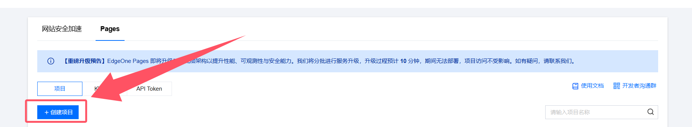

## 前言：
当你看到这篇博客的时候，幻梦博客的迁移应该已经进入尾声了。先说为什么要迁移。

几天前，当幻梦临睡时偶然发现博客上不去了，报了一个422的错误。通常这是证书过期又或是协议错误的表现，但是这天幻梦并没有对网站进行任何设置，访问下百度试试，好吧还是报错。由于是全局魔法，幻梦首先把目标放在了魔法上。关掉魔法，刷新还是报错；重启路由、光猫、交换机还是报错；又开启魔法，报错消失了，但是手机上还是无法正常访问博客；再关掉魔法手机上能访问了，电脑端也能访问了，但是公网环境手机依旧不能访问博客。

emmmmm，这就很奇怪了。正当幻梦打算重启服务器的时候，突然博客访问又恢复了正常。好吧看着已经到一点的份上还是别折腾自己了。

第二天炸裂的就来了。短信提醒“因为移动网络波动如有问题请联系……”是致歉短信。好吧“家里云”隔三差五出问题好像并不是很好用，该跑路了。

于是你就看到这个博客从halo迁移到了Edgeone Pages，变成了一个静态站。
## 第一步：部署Astro
这是这个流程里最简单的一步了，首先拉取一个你喜欢的Astro主题或者原版Astro。

1. 比如幻梦选择的是Fuwari主题`pnpm create fuwari@latest`通过这个命令即可完成部署。原版的话可以看这里`pnpm create astro@latest`通过这个命令可以拉取原版的Astro。
2. 因为我们需要部署在Edgeone上所以我们需要添加一些支持[https://docs.astro.build/zh-cn/guides/deploy/edgeone-pages/](https://docs.astro.build/zh-cn/guides/deploy/edgeone-pages/)这是astro官方文档的建议，我们需要前往Edgeone查看更详细的文档。[https://pages.edgeone.ai/document/framework-astro](https://pages.edgeone.ai/document/framework-astro#b1042e3a-c859-4565-be83-e84faa5ed3d9)。
   1. 我们第一步先安装适配器`npm install @edgeone/astro`
   2. 在`astro.config.mjs`中加入以下内容。
```
import { defineConfig } from "astro/config";
import edgeoneAdapter from "@edgeone/astro";

export default defineConfig({
  adapter: edgeoneAdapter(),
});
```
3. 接下来我们正常向github提交我们的博客项目，然后进入Edgeone Pages控制台[https://console.cloud.tencent.com/edgeone/pages](https://console.cloud.tencent.com/edgeone/pages)

选择导入github仓库，选择我们刚刚上传的博客仓库，这样当我们每进行一次提交就可以让Edgeone Pages自动进行部署。
## 第二步：部署DecapCMS
这一步其实就会复杂一点。因为不同主题的博客配置其实会有差异，这里一定要先看你主题的示例文档。astro官方文档[https://docs.astro.build/zh-cn/guides/cms/decap-cms/#%E5%AE%89%E8%A3%85-decapcms](https://docs.astro.build/zh-cn/guides/cms/decap-cms/#%E5%AE%89%E8%A3%85-decapcms)
1. 先在博客中安装DecapCMS。`pnpm add decap-cms-app`
2. 在`src/pages/`路径下，新建`admin.html`文件。如果你也是Fuwari主题可以直接抄配置文件。
```
<!doctype html>
<html lang="zh_CN">
  <head>
    <meta charset="utf-8" />
    <meta name="viewport" content="width=device-width, initial-scale=1.0" />
    <meta name="robots" content="noindex" />
    <!-- 由于Edgeone Pages无法通过text/yaml格式加载yml文件所以我们必须通过raw.githubusercontent.com，或fastly.jsdelivr.net完成引入 -->
    <link href="https://raw.githubusercontent.com/你的github用户名/你的博客仓库/refs/heads/main/public/admin/config.yml" type="text/yaml" rel="cms-config-url" />
    <title>内容管理器</title>
  </head>
  <body>
    <script src="https://unpkg.com/decap-cms@^3.1.2/dist/decap-cms.js"></script>
  </body>
</html>
```
3. 在`public/admin/`路径下，新建`config.yml`文件，进入编辑
```
collections:
  - name: "terminal" # 用于路由，例如，/admin/collections/blog
    label: "paper" # 在 UI 中使用
    folder: "src/content/posts" # 存储文档的文件夹路径
    create: true # 允许用户在此集合中创建新文档
    fields: # 每个文档的字段，通常在 front matter 中
      - { label: "标题", name: "title", widget: "string" }
      - { label: "发布日期", name: "published", widget: "datetime", format: "YYYY-MM-DD" }
      - { label: "描述", name: "description", widget: "text", required: false }
      - { label: "封面图片", name: "image", widget: "image", default: "https://rdimg.yumehinata.com/random-wallpaper"}
      - { label: "标签", name: "tags", widget: "list", required: false }
      - { label: "分类", name: "category", widget: "string", required: false }
      - { label: "草稿状态", name: "draft", widget: "boolean", default: false }
      - { label: "正文", name: "body", widget: "markdown" }
media_folder: "/src/content/posts/images" # 文件将被存储在仓库中的位置
# public_folder: "./images" # 上传媒体文件的 src 属性
backend:
  name: github
  repo: "你的github用户名/博客仓库"
  branch: "main" # 选择对应的分支，默认是main分支或者master分支
  api_root: "https://api.github.com"
  site_url: "你站点的url" # 例如https://example.com
  base_url: "你站点的url"
  auth_endpoint: "auth" # 后续使用幻梦提供的外部 OAuth 客户端可以保持不变
```
4. 外部 OAuth 客户端
先看官方推荐的，虽然Edgeone没法直接用但是可以自己修改着部署用[https://decapcms.org/docs/external-oauth-clients/](https://decapcms.org/docs/external-oauth-clients/)。

   然后是幻梦毛遂自荐的修改项目：

   ::github{repo="YumeHinata/dacap-cms-edgeone-pages"}

   请看项目的Readme.md文件完成部署。
## 疑难杂症
与其说疑难杂症更应该说是未解决的问题。
1. Fuwari会对图片资源进行优化，所以你必须使用`./xxxx/xxxx.jpg`或者`./xxx.png`这样相对路径，绝对不要用`/src/ports/images`或`src/posts/images`这样的路径，或者就使用fastly、github raw、jsdelivr的绝对路径。
2. yaml和yml在edgeone直接引用一定会出问题，包括json文件也有可能遭遇这个问题，所以你只能用fastly、github raw、jsdelivr，但是需要注意，fastly和jsdelivr具有缓存时间，并不是你实时上传的内容，而jsdelivr与github raw在部分地区被污染无法正常使用。
3. DecapCMS的配置文件必须得写`posts/images`相对路径（相对于文件根目录），所以实际在你复制资源的路径时他给你的会是`posts/images/xxxx.jpg`这样的格式，这会导致第一条提到的问题，这大概是Fuwari特有的问题，请自行修改为`./images/xxxx.jpg`使用（Fuwari的编译时，根目录应该为文档文件所在目录为根目录）或自己修改Decap的代码来一步到位实现。
